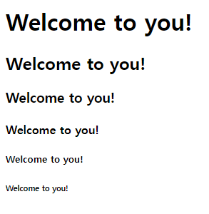
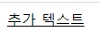
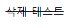
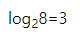
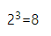

# HTML 텍스트

## hn 태그
- `제목이나 주제를 나타내는 텍스트`를 표현할 때 사용한다.
```
<hn>제목</hn>
```
- hn 태그는 h1부터 h6까지 6개가 있다.

```
<h1>Welcome to you!</h1>
<h2>Welcome to you!</h2>
<h3>Welcome to you!</h3>
<h4>Welcome to you!</h4>
<h5>Welcome to you!</h5>
<h6>Welcome to you!</h6>
```

</br>

- 결과



## p 태그
- `본문의 문단(paragraph)을 작성`할 때 사용한다.

```
<p>내용</p>
```

## br 태그
- `문단에서 줄 바꿈할 때 사용`한다.

```
<br>
```

## blockquote 태그
- `출처에서 인용한 문단 단위의 텍스트를 작성`할 때 사용한다.
- 이 때 출처가 확실한 인용문은 cite 속성으로 출처 경로를 명시해야 한다.

```
<blockquote cite="출처 URL">문단 단위 인용문</blockquote>
```
## q 태그
- 문단 위에 텍스트 단위의 `짧은 인용문을 작성`할 때 사용할 수 있는 태그이다.
- q 태그를 사용한 콘텐츠는 큰 따옴표("")로 묶인다.

```
<q cite="출처 URL">짧은 인용문</q>
```

## ins 태그
  - `새로 추가된 텍스트`임을 나타낼 때 사용한다.
- ins 태그를 사용한 콘텐츠에는 `밑줄이 생긴다.`

```
<ins>추가 텍스트</ins>
```
</br>

- 결과



## del 태그
- `기존에 있던 텍스트가 삭제된 텍스트`임을 나타낼 때 사용한다.
- del 태그를 사용한 콘텐츠에는 `취소선이 생긴다.`
```
<del>삭제 테스트</del>
```

</br>

- 결과



## sub 태그
- `아래 첨자를 작성`할 때 사용한다.

```
<sub>아래 첨자</sub>
```
</br>

- 예시
```
log<sub>2</sub>8=3
```
</br>

- 결과



## sup 태그
- `위 첨자를 작성`할 때 사용한다.

```
<sup>위 첨자</sup>
```

</br>

- 예시
```
2<sup>3</sup>=8
```

</br>

- 결과

