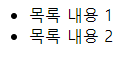
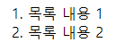
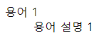

# HTML 목록

## ul 태그
- `순서가 없는 비순서형 목록`을 생성할 때 사용한다.
-`이 때 목록 내용은 li 태그로 구성`한다.
- 목록 내용마다 `글머리 기호가 붙는다.`

```
<ul>
    <li>목록 내용 1</li>
    <li>목록 내용 2</li>
</ul>
```

</br>

- 결과



## ol 태그
- `순서형 목록을 생성할 때 사용`한다.
- ul 태그와 마찬가지로 `li 태그로 목록 내용을 구성`한다.
- `목록 내용에 번호가 붙는다.`

```
<ol>
    <li>목록 내용 1</li>
    <li>목록 내용 2</li>
</ol>
```

</br>

- 결과



## dl 태그
- `정의형 목록을 만들 때 사용`한다.
- 정의형 목록은 `용어와 용어 설명을 나열한 형태의 목록`이라고 봐도 된다.
- dl 태그로 `목록을 생성할 때`는 li 태그 대신에 `dt 태그로 용어`를 쓰고, `dd 태그로 용어 설명을 작성`한다.

```
<dl>
    <dt>용어 1</dt>
    <dd>용어 설명 1</dd>
</dl>
```

</br>

- 결과


