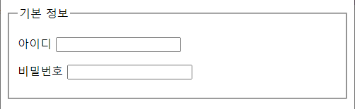
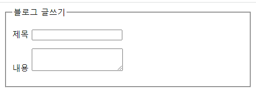
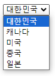
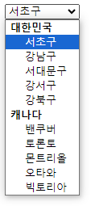

# HTML 폼 구성

## form 태그
- 폼 양식을 의미하는 태그이다.
- HTML의 폼은 구성하는 태그는 모두 form 태그 안에 작성한다.

```
<form action="서버 url" method="get 또는 post"></form>
```

### action 속성
- 폼 요소에서 사용자와 상호작용으로 입력받은 값들을 전송할 서버의 URL 주소를 적는다.

### method 속성
- 입력받은 값을 서버에 전송할 때 송신 방식을 적는다. 속성 값으로 get 또는 post를 사용할 수 있다.
- 보안이 요구되는 정보라면 method 속성 값에 "post"를 입력한다.
- 보안이 요구되지 않은 경우에는 method 속성 값에 "get"을 입력한다.

### input 속성
- 로그인 페이지의 아이디와 비밀번호처럼 입력받은 요소를 생성할 때 input 태그를 사용한다ㅏ.
- input 태그에는 type, name, value 속성이 있다.
- type 속성은 필수로 사용해야 하고, name과 value 속성은 선택해서 사용할 수 있다.

```
<input type="종류" name="이름" value="초깃값">
```

### type 속성
- 입력된 값에 따라 상호작용 요소의 종류를 결정한다.
- 입력 요소는 아이디나 비밀번호를 입력받은 요소 외에도 콤보박스, 파일 업로드, 체크 박스, 라디오 버튼 등 다양하다.

|속성값|설명|
|---|---|
|text|한 줄 텍스트를 입력할 수 있는 요소를 생성한다.|
|password|비밀번호를 입력할 수 있는 요소를 생성한다.|
|tel|전화번호 형식을 입력할 수 있는 요소를 생성한다.|
|number|숫자만 입력할 수 있는 요소를 생성한다.|
|url|URL 주소 형식을 입력할 수 있는 요소를 생성한다.|
|search|검색용 텍스트를 입력할 수 있는 요소를 생성한다.|
|email|이메일 형식을 입력할 수 있는 요소를 생성한다.|
|checkbox|체크 박스 요소를 생성한다.|
|radio|라디오 버튼 요소를 생성한다.|
|file|파일 업로드 요소를 생성한다.|
|button|버튼 요소를 생성한다.|
|image|이미지로 버튼 요소를 생성한다. 따라서 img 태그처럼 src 속성을 사용해야 한다. 단 alt 속성은 사용하지 않는다.|
|hidden|사용자 눈에 보이지 않는 입력 요소를 생성한다.|
|date|날짜(연, 월, 일)을 선택할 수 있는 입력 요소를 생성한다.|
|datetime-local|사용자 시간 대에 맞는 날짜(연, 월, 시, 분)를 선택할 수 있는 입력 요소를 생성한다.|
|month|날짜(연, 월)를 선택할 수 있는 입력 요소를 생성한다.|
|week|날짜(연, 주차)를 선택할 수 있는 입력 요소를 생성한다.|
|time|시간을 선택할 수 있는 입력 요소를 생성한다.|
|range|숫자 범위를 선택할 수 있는 슬라이드 요소를 생성한다.|
|color|색상을 선택할 수 있는 요소를 생성한다.|
|submit|폼 전송 역할을 하는 버튼 요소를 생성한다.|
|reset|폼 요소에 사용자가 입력한 값을 초기화하는 버튼 요소를 생성한다.|

```
<input type="text">
<input type="password">
<input type="tel">
<input type="number">
<input type="url">
<input type="search">
<input type="email">
<input type="checkbox">
<input type="radio">
<input type="file">
<input type="button">
<input type="image" src="apple.png>
<input type="hidden">
<input type="date">
<input type="datetime-local">
<input type="month">
<input type="week">
<input type="time">
<input type="range">
<input type="color">
<input type="submit">
<input type="reset">
```

### name 속성
- 입력 요소의 이름을 작성한다.
- 입력 요소가 form 태그에 의해 서버로 전송될 때 name 속성에 적힌 값이 이름으로 지정된다.
- 서버에서는 지정된 이름으로 입력 요소를 식별할 수 있다.

### value 속성
- 입력 요소의 초기값을 작성한다.
- 입력 요소는 보통 사용자에게서 수동으로 값을 입력받지만, 상황에 따라 초깃값을 설정해야 하는 경우가 있을 때 사용하는 속성이다.

## label 태그
- form 태그 안에서 사용하는 상호작용 요소에 이름을 붙일 때 사용한다.
- label 태그를 잘 사용하면 label 태그만 클릭해도 상호작용 요소를 선택할 수 있다.
- label 태그는 사용하는 방법에 따라 암묵적인 방법과 명시적인 방법으로 구분한다.

- 암묵적인 방법은 label 태그에 상호작용 요소를 포함하는 방법이다.

```
<label>
    아이디
    <input type="text"> <!--상호작용 요소 -->
```

## fieldset 태그와 legend 태그

- form 태그 안에 사용된 다양한 상호작용 요소도 fieldset 태그를 사용해 그룹 지을 수 있다.
- fieldset 태그로 그룹을 지으면 `그룹별로 박스 모양의 테두리`가 생긴다.
- 그룹 지은 요소들을 legend태그로 이름을 붙일 수 있다.

```
<form action="#">
    <fieldset>
        <legend>그룹 이름</legend>
    </fieldset>
</form>
```

- 예시

```
<form>
    <fieldset>
        <legend>기본 정보</legend>
        <p>
            <label for="userid">아이디</label>
            <input type="text" id="userid">
        </p>
         <p>
            <label for="passwd">비밀번호</label>
            <input type="password" id="passwd">
        </p>
    </fieldset>
</form>
```
</br>

- 결과


</br>
## textarea 태그
- `여러 줄의 입력 요소를 생성`할 때 input 태그가 아닌 textarea 태그를 사용한다.
- 웹 사이트에서 글을 작성할 때 사용하는 입력 요소는 대부분 textarea 태그로 생성한다.

```
<textarea>초깃값</textarea>
```

- textarea는 input 태그와는 다르게 닫는 태그가 있다.
- input 태그로 생성한 입력 요소의 초깃값을 value 속성으로 정의하지만, textarea 태그로 생성한 여러 줄의 입력 요소는 콘텐츠 영역에 초깃값을 정의한다.
</br>

- 예제
```
<form action="#" method="post">
    <fieldset>
        <legend>블로그 글쓰기</legend>
        <p>
            <label for="title">제목
            <input type="text" id="title" name="title">
            </label>
        </p>
        <p>
            <label for="desc">내용
            <textarea id="desc" name="title"></textarea>
            </label>
        </p>
    </fieldset>
</form>
```
</br>

- 결과



</br>

## select, option, optgroup 태그
- select 태그를 사용하면 콤보박스를 생성할 수 있다.
- 콤보박스에 항목 하나를 추가할 때는 option 태그를 사용한다.
- 항목들을 그룹으로 묶고 싶으면 optgroup 태그를 사용한다.

```
<select>
    <optgroup label="그룹 이름">
        <option value="서버에 전송할 값">웹 브라우저에 표시할 값</option>
    </optgroup>
</select>
```

- option 태그는 서버에 전송할 값을 value 속성으로 지정할 수 있다.
- 속성을 생략하면 option 태그의 콘텐츠는 적은 텍스트가 값으로 전송된다.
- optgroup 태그로 항목들을 그룹 지을 때 반드시 label 속성으로 그룹명을 지정해야 한다.

</br>

- 예시 1

```
<select name="country" id="country">
    <option value="대한민국">대한민국</option>
    <option value="캐나다">캐나다</option>
    <option value="미국">미국</option>
    <option value="중국">중국</option>
    <option value="일본">일본</option>
</select>
```

</br>

- 결과



</br>

- 예시 2

```
<select name="country" id="country">
    <optgroup label="대한민국">
        <option value="서초구">서초구</option>
        <option value="강남구">강남구</option>
        <option value="서대문구">서대문구</option>
        <option value="강서구">강서구</option>
        <option value="강북구">강북구</option>
    </optgroup>
    <optgroup label="캐나다">
        <option value="밴쿠버">밴쿠버</option>
        <option value="토론토">토론토</option>
        <option value="몬트리올">몬트리올</option>
        <option value="오타와">오타와</option>
        <option value="빅토리아">빅토리아</option>
    </optgroup> 
</select>
```
</br>

- 결과

